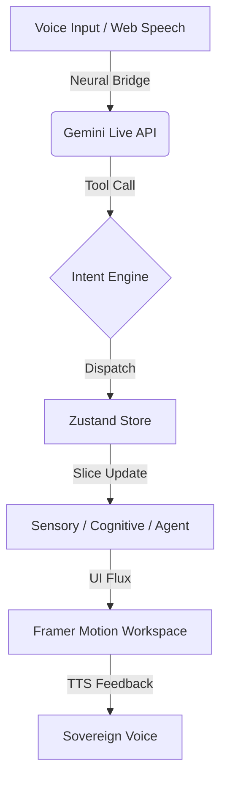

# 🌌 GemigramOS — Voice-First Sovereign Intelligence

> **Win the Gemini Live Agent Challenge 2026.**  
> GemigramOS is a Sovereign Intelligence Orchestration System designed for seamless, voice-first coordination between humans and specialized AI agents.

## 🚀 Live Demo
**Dashboard:** [https://notional-armor-456623-e8.web.app](https://notional-armor-456623-e8.web.app)

---

## 🧠 Architecture
GemigramOS operates on a **5-Slice Neural Store** architecture, ensuring zero-friction state propagation across sensory, cognitive, and agent-driven layers.



---

## 🛠️ Tech Stack

| Component | Technology | Version |
|-----------|------------|---------|
| **Core Framework** | Next.js (App Router) | ^15.4.9 |
| **Intelligence** | Gemini Live API / @google/generative-ai | ^0.24.1 |
| **State Engine** | Zustand (5-Slice Immutable Architect) | ^5.0.12 |
| **Persistence** | Firebase (Firestore / Auth) | ^12.10.0 |
| **Motion/UX** | Framer Motion / TailwindCSS | ^12.36.0 / ^3.4.19 |
| **Typed Logic** | TypeScript | ^5.9.3 |

---

## ⚡ Quick Start

### 1. Clone & Install
```bash
git clone https://github.com/Moeabdelaziz007/Gemigram.git
cd Gemigram
npm install
```

### 2. Configure Environment
Create a `.env.local` file in the root:
```env
NEXT_PUBLIC_FIREBASE_API_KEY=your_key
NEXT_PUBLIC_FIREBASE_AUTH_DOMAIN=your_project.firebaseapp.com
NEXT_PUBLIC_FIREBASE_PROJECT_ID=your_project_id
# Gemini Token is handled via secure server routes
```

### 3. Launch Development
```bash
npm run dev
```

---

## 📂 Project Structure

```bash
├── app/                  # Next.js App Router (Workspace, Forge, Hub)
├── components/           # UI Components (Galaxy, Workspace, Shared)
├── lib/                  # Core Business Logic
│   ├── store/            # 5-Slice Neural Store (Zustand)
│   ├── hooks/            # Voice-First Custom Hooks
│   ├── types/            # Strict TypeScript Definitions
│   └── utils/            # Bridge & Network Managers
├── docs/                 # Architectural Blueprints & API Docs
└── public/               # Static Assets & Neural Worklets
```

---

## 🎙️ Voice Flow

```text
USER AUDIO → [Neural-Spine-Processor] → [Gemini Live WebSocket]
                                            ↓
GEMINI RESPONSE ← [Intent Logic] ← [ToolCall: navigate_to_forge]
```

---

## 🗺️ Roadmap (V3.0)

- [x] **Phase 19**: Neural Store Migration (5-Slices Complete)
- [x] **Phase 13**: CI/CD Syntax Stabilization
- [/] **Phase 20**: Documentation & Repo Organization (IN PROGRESS)
- [ ] **Phase 21**: Semantic Memory Integration
- [ ] **Phase 22**: 3D Galaxy Physics Optimization

---

## 🤝 Contributing
Please read [CONTRIBUTING.md](./CONTRIBUTING.md) for branch naming conventions and PR protocols.

---

## 📄 License
Sovereign Intelligence License — See [LICENSE](./LICENSE) (MIT assume).
