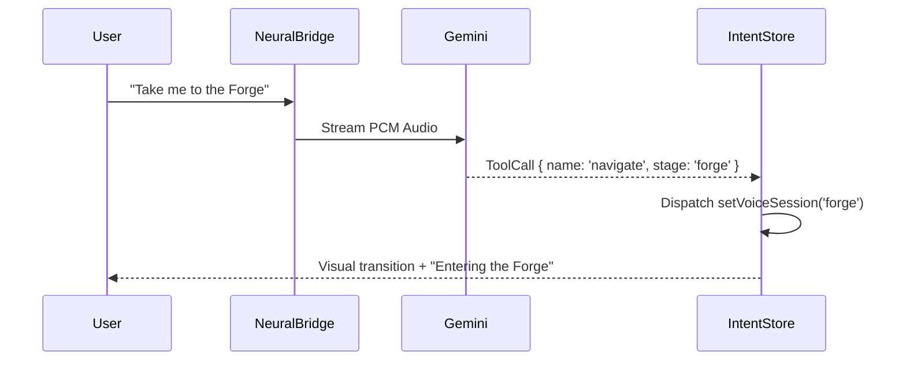

# 🧬 GemigramOS Architecture

## 1. The Neural Store (Zustand 5-Slice)
We utilize a fragmented but unified store to manage high-frequency voice data without re-rendering the entire dependency tree.

### Slices:
- **SensorySlice**: Transcripts, streaming buffers, and audio interactivity (volume, speaking states).
- **CognitiveSlice**: Session state, metadata (session ID, agent name), and performance metrics (latency, tokens).
- **AgentSlice**: Agent registry (active agent, project metadata).
- **UiSlice**: Voice session stages (`landing`, `forge`, `workspace`) and bridge links.
- **AuthSlice**: Hydrated user ID (Security-first, no raw tokens).

---

## 2. Voice-First Intent Engine
GemigramOS follows a strict **Anti-Parsing** policy. All navigation is driven by Gemini ToolCalls.

---

## 3. Route Matrix
- `/dashboard` — Sovereign Command Center.
- `/workspace` — Active Real-time Neural Link.
- `/forge` — Entity Creation (Voice-Only).
- `/hub` — Agent Catalog.
- `/galaxy` — 3D Neural Topology.

---

## 4. Network Layer
- **Local Bridge**: `scripts/aether-local-bridge.ts` handles low-latency WebSocket routing for local builds.
- **Firebase Persistence**: `onSnapshot` used for real-time reactivity in the Agent Registry.
